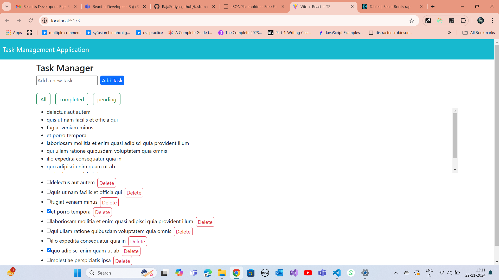

# task-manager

node - 20.11.0
npm - 10.8.1

start the application
npm i 
npm run dev

in this app i use 
 Core Functionality:
  •  Users should be able to:
  •  Add a new task with a title.
  •  Mark tasks as completed/uncompleted.
  •  Delete tasks.
  3.  State Management:
  •  Use Redux for state management and complete the flow with actions and reducers
  4.  Basic API Integration:
  •  Simulate API calls using fetch or Axios to load initial tasks from a JSON file or mock API (e.g., JSONPlaceholder).
  •  Implement adding and deleting tasks with appropriate mock API calls.

